## Flutter with Supabase Project

- A Flutter application for article management using Supabase as a backend.

----
##  ⚠ Important Notice

- The application requires a full internet connection to work, as it completely relies on Supabase for backend and database services.

----
 ## Overview

- An article management application built with Flutter and Supabase, featuring a complete authentication system, article display, and comment system.

----
## Main Features

## Complete Authentication System

· Start screen
· Onboarding screens
· Complete login and registration

## Main Interfaces

· Home page
· Article display
· Add articles
· Favorite articles
· User articles
· Article content display

## Search & Navigation

· Search articles by title
· Side drawer containing:
· User profile
· User articles
· Account data

## Comment System

· Add comments to articles
· Nested reply system
· Edit and delete comments capability

----
## Technologies Used

· Flutter - UI Framework
· Dart - Programming Language
· Supabase - Backend & Database

----
## Screenshots
<div align="center">
  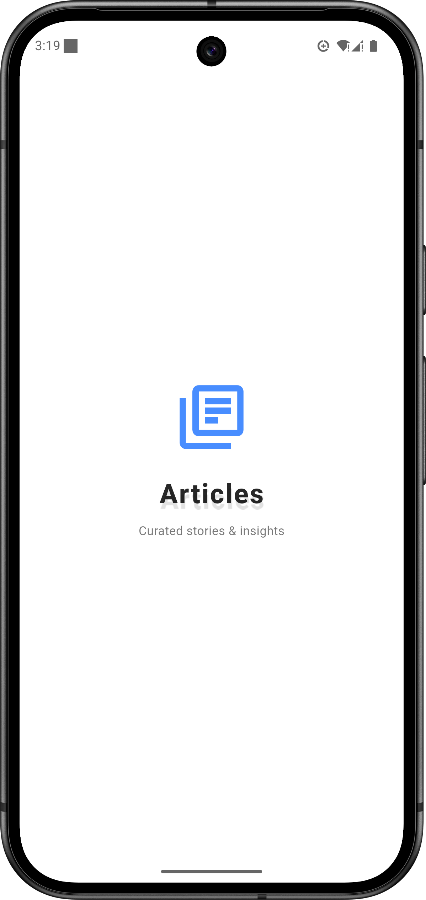
  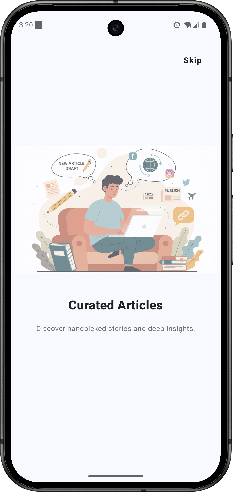
  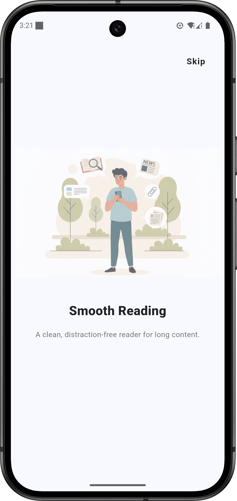
  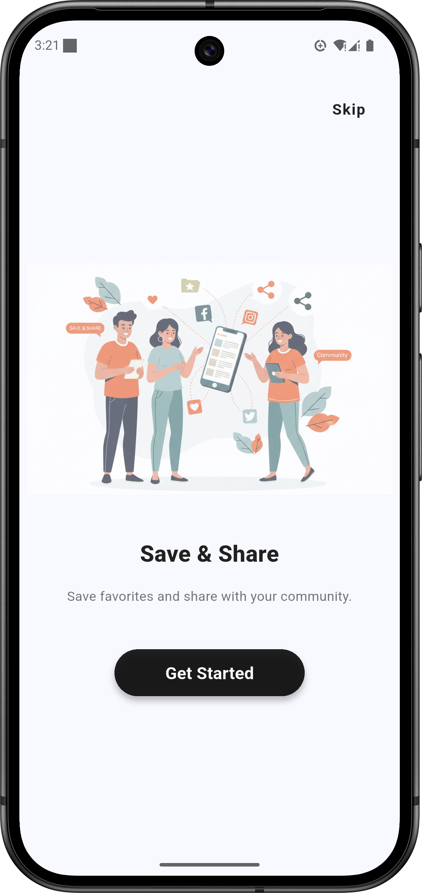
  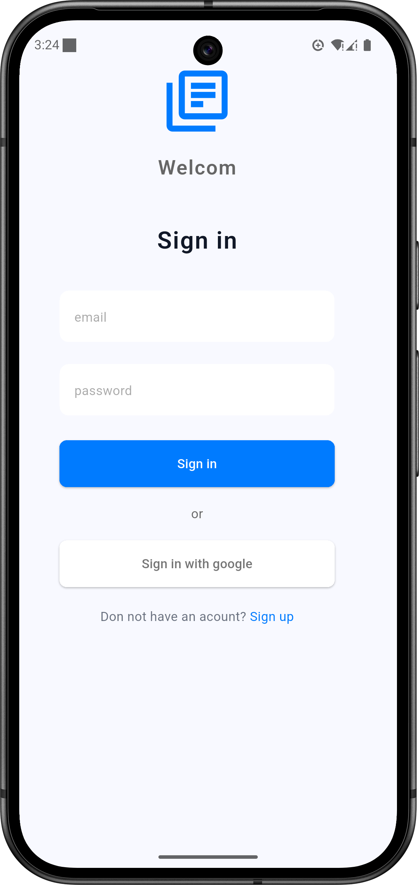
  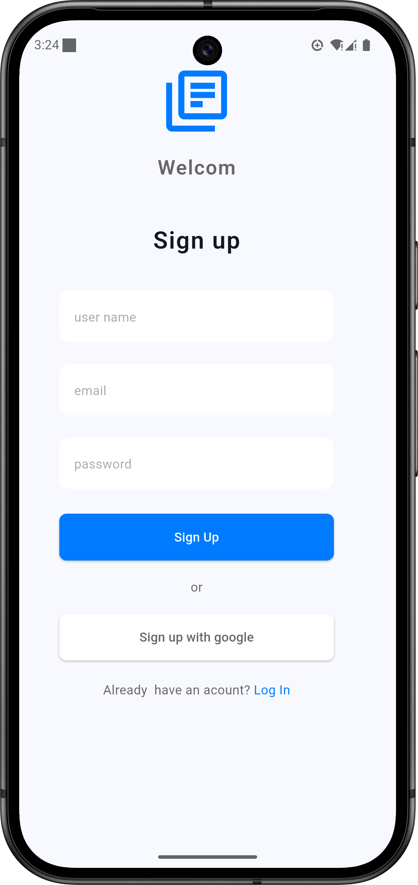
  
  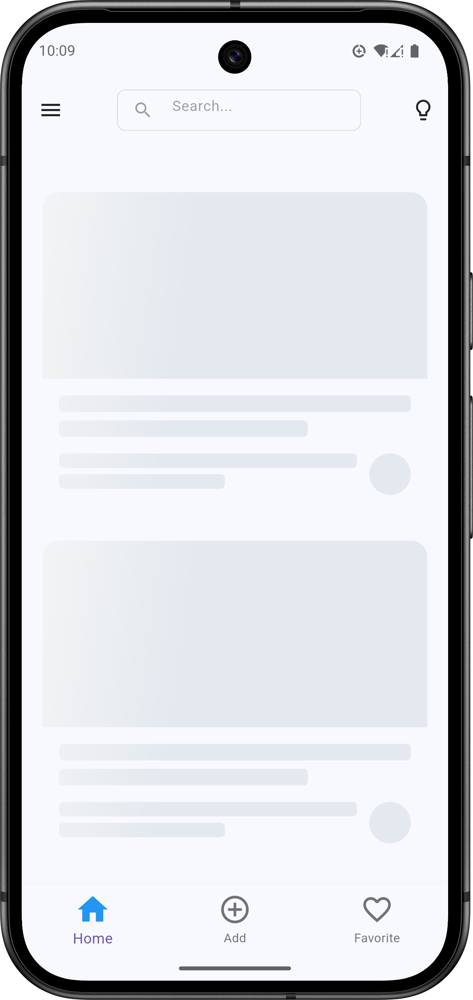
  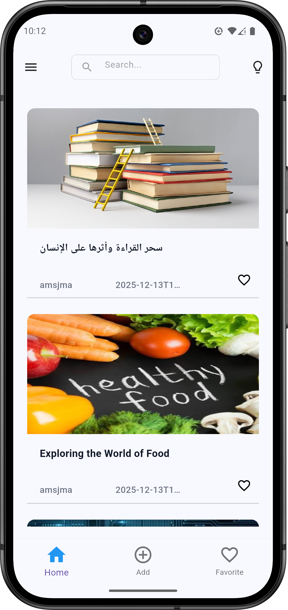
  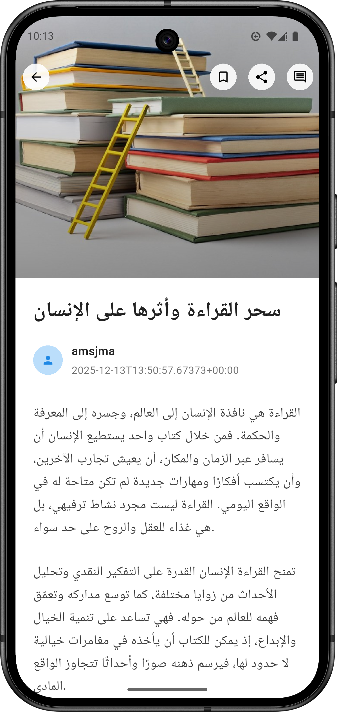
  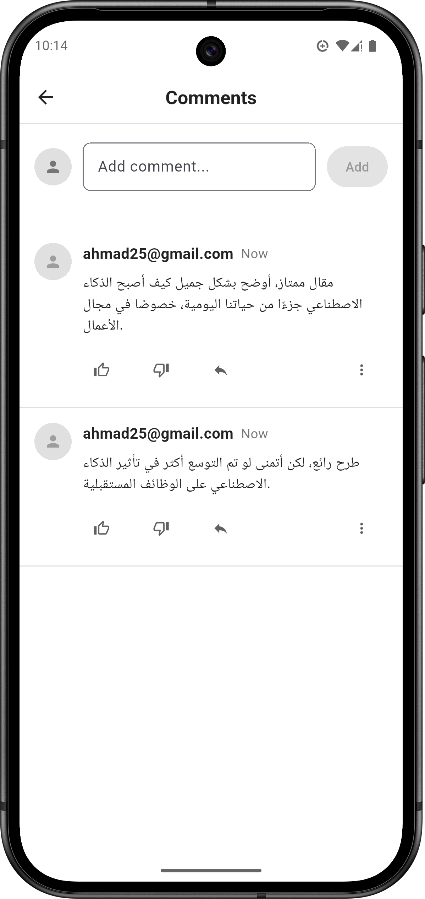
  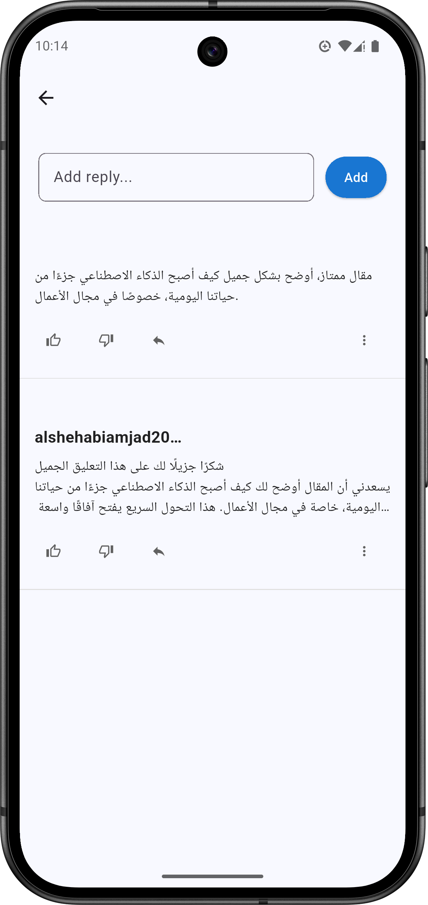
   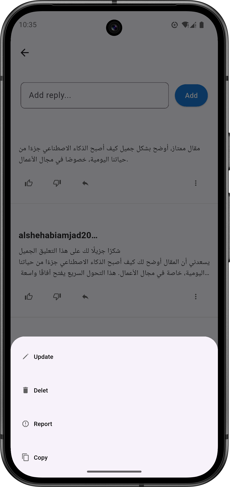
   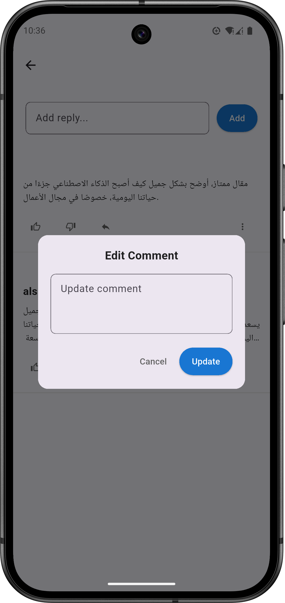
  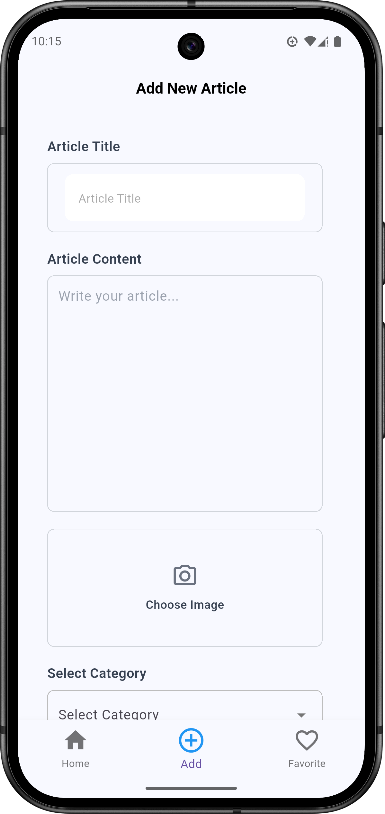
  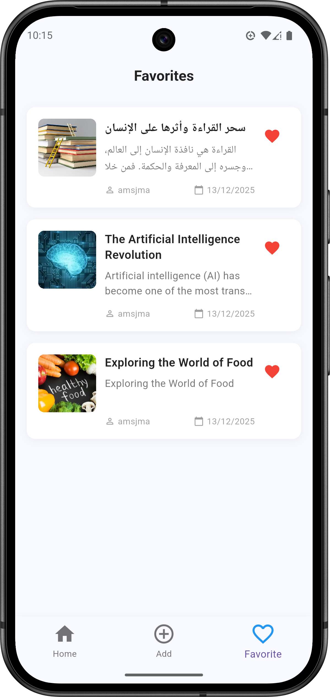
  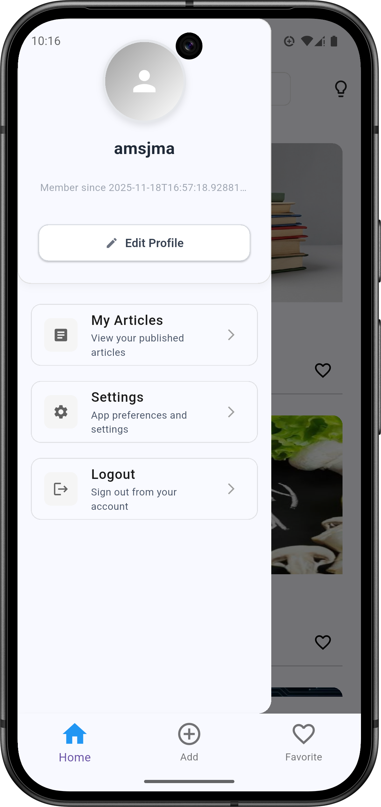
  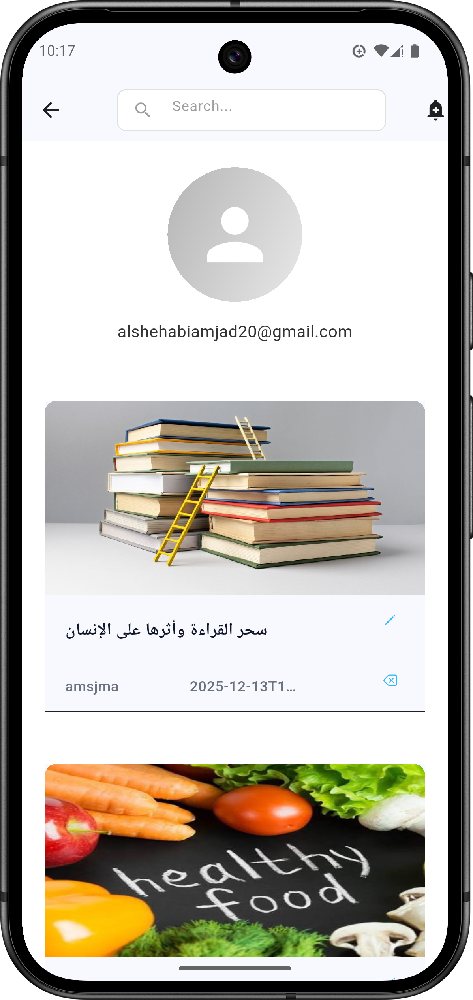
  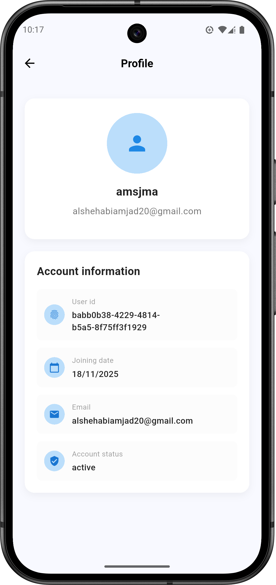
 images2/add_article.png


</div>

----

## Project Structure
````text
│   main.dart
│   onboarding_colors.dart
│   style.dart
│   test.dart
│   
├───fonts
│       font12.ttf
│       
├───generated
│       assets.dart
│       
├───Models
│       OnboardingItem_Model.dart
│       
├───screens
│       add_article_screen.dart
│       article_detail_screen.dart
│       comments_screen.dart
│       favorites_screen.dart
│       home_screen.dart
│       listpages_screen.dart
│       onboarding_screen.dart
│       profiel_Screen.dart
│       profile_drawer_screen.dart
│       reply_comments_screen.dart
│       signin_screen.dart
│       signup_screen.dart
│       start_screen.dart
│       user_article_screen.dart
│       user_profile_screen.dart
│
├───services
│       articles_service.dart
│       auth_servire.dart
│       comments_service.dart
│       favorites_service.dart
│       replies_service.dart
│       user_repository_service.dart
│
├───utils
│       validators.dart
│
└───widgets
    │   article_card.dart
    │   elevated_button.dart
    │   form_input_field.dart
    │   Icon_button_widget.dart
    │   post_shimmer.dart
    │   reusable_search_widget.dart
    │   Text_widget.dart
    │
    ├───article_widgets
    │       article_dropdown.dart
    │       article_textfield_content.dart
    │       article_textfield_title.dart
    │       imagepicker_widget.dart
    │
    ├───comments_screen_widgets
    │       add_comment_section.dart
    │       comment_actions.dart
    │       comment_card.dart
    │       update_Comment_dialog.dart
    │
    ├───favorite_screen_widgets
    │       favorite_card.dart
    │
    ├───profile_widget
    │       menu_card.dart
    │       profile_header.dart
    │
    ├───reply_widgets
    │       Interaction_button.dart
    │       reply_button.dart
    │       reply_card.dart
    │       reply_show_model_bottom_Sheet.dart
    │       reply_Text_field.dart
    │
    ├───user_aricle_widget
    │       UserArticle_Card.dart
    │
    └───user_profile_widgets
            avatar_name_section.dart
            info_card_widget.dart


````


## 📦 Installation & Run


### Prerequisites
- Flutter SDK 3.35.2 or higher
- Dart SDK 3.9.0 or higher
- Android emulator or physical device

### Run Steps
1. Clone the repository
2. Navigate to project directory
3. Install dependencies
4. Run the application
## Dependencies

```yaml
dependencies:
  flutter:
  cupertino_icons: ^1.0.8
  image_picker: ^1.2.0
  uuid: ^4.5.1
  supabase_flutter: ^2.10.3
  cached_network_image: ^3.4.1
  flutter_image_compress: ^2.4.0
  concentric_transition: ^1.0.3
  flutter_svg: ^2.2.3
  shared_preferences: ^2.5.3
  google_fonts: ^6.3.3
  shimmer: ^3.0.0
  sdk: flutter
supabase_flutter: ^2.0.0
```

---
## Future Development

- Adding new features and improving existing functions to complete the application.


----
## Developer

- Amjad Alshehabi [aslhehabiamjad28@gmail.com],


---

-  If you like this project ⭐
